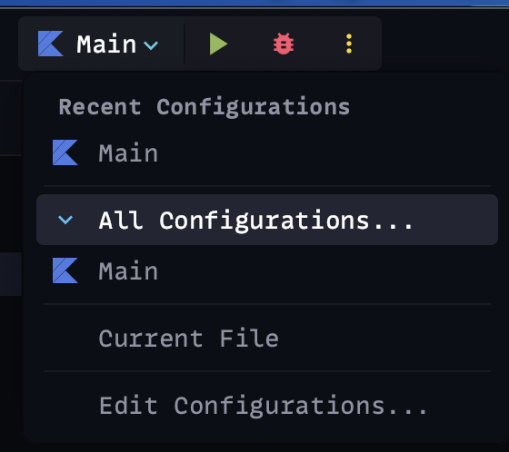

# Drone Delivery Service - Velozient Assessment

## Algorithm and Approach

The idea behind the algorithm used in the project was to simply check for each location
and each drone.

For the given location if a drone was able to carry that package weight within the current
trip, it would be assigned to it. Otherwise a new trip would be created and we would
check for the location package weight and the drone maximum weight again.

The algorithm assigns a list of trips for each drone. Each trip includes a list of locations
visited in that trip, meaning packages where delivered to said location.

### Technical dependencies:

- [Kotlin 1.8.0](https://github.com/JetBrains/kotlin/releases/tag/v1.8.0)
- [Gradle 7.5](https://github.com/gradle/gradle/releases/tag/v7.5.0)
- [JUnit 5.9.2](https://github.com/junit-team/junit5/releases/tag/r5.9.2)
- [IntelliJ IDEA 2022.3.3](https://www.jetbrains.com/idea/)

### Build project:

~~~sh
$ ./gradlew build
~~~

### Execute tests:

~~~sh
$ ./gradlew test
~~~

### Run project:

1. Open the project folder in IntelliJ IDEA
2. Look for the execution options in the top bar of the IDE

   

    And click the green triangle/arrow icon
3. An execution panel will appear with the execution output
